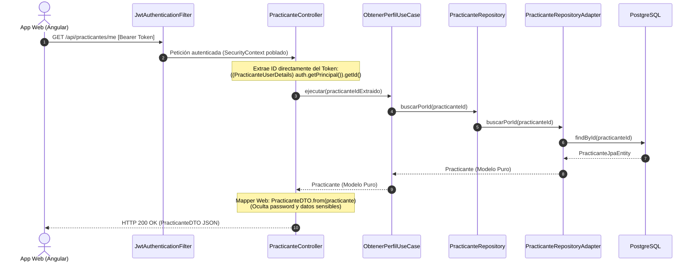
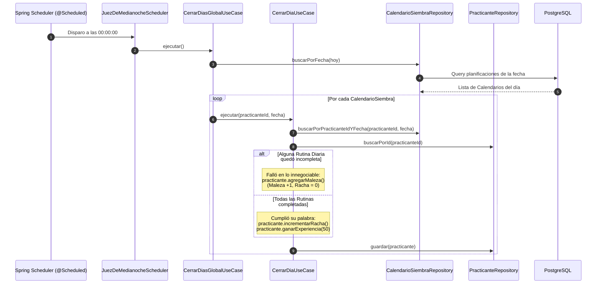

# 🏛️ Agenda Hunter (Zen Edition) — Masterclass de Arquitectura & Auditoría Enterprise

> [!ABSTRACT] Resumen Ejecutivo
> Este documento representa la **ingeniería inversa exhaustiva** y la **auditoría técnica de nivel Staff** del sistema *Agenda Hunter (Zen Edition)*.
> Integra el mapa de ejecución real, conceptos de diseño explicados didácticamente ("con peras y manzanas"), auditoría de aislamiento hexagonal, vectores de vulnerabilidad IDOR y refactorizaciones críticas de concurrencia y escalabilidad. Diseñado para estudio profundo y referencia en **Obsidian**.

---

## 🗺️ 1. El Mapa de Ejecución Real (Flujo de Datos)

En una **Arquitectura Hexagonal (Ports & Adapters)** estricta, ninguna petición salta capas arbitrariamente. Cada componente tiene una única responsabilidad y las dependencias siempre apuntan hacia adentro:

$$\text{Infraestructura (Web / Persistencia)} \longrightarrow \text{Aplicación (Casos de Uso)} \longrightarrow \text{Dominio (Modelos & Invariantes)}$$

---

### Flujo A: La Acción de Batalla — Completar un Pomodoro
* **Ruta HTTP:** `POST /api/v1/tareas-enfoque/{id}/completar-ciclo`
* **Propósito:** Validar que transcurrieron 25 minutos reales en el servidor, sellar el ciclo y premiar al Practicante con Armonía y Experiencia RPG.

```mermaid
sequenceDiagram
    autonumber
    actor Cliente as App Web / Móvil
    participant Sec as JwtAuthenticationFilter
    participant Ctrl as TareaEnfoqueController
    participant UC as CompletarCicloActualUseCase
    participant Port as TareaEnfoqueRepository (Puerto)
    participant Adapter as TareaEnfoqueRepositoryAdapter
    participant Model as TareaEnfoque (Dominio Puro)
    participant UserPort as PracticanteRepository (Puerto)
    participant UserModel as Practicante (Dominio Puro)
    participant DB as PostgreSQL

    Cliente->>Sec: POST /api/v1/tareas-enfoque/{id}/completar-ciclo [Bearer Token]
    Note over Sec: Valida firma JWT, extrae email y establece SecurityContext
    Sec->>Ctrl: Despacha petición al Controller
    Ctrl->>UC: ejecutar(tareaId)
    UC->>Port: buscarPorId(tareaId)
    Port->>Adapter: buscarPorId(tareaId)
    Adapter->>DB: findById(UUID) [SpringData JPA]
    DB-->>Adapter: TareaEnfoqueJpaEntity
    Note over Adapter: Mapper: JPA Entity ➔ TareaEnfoque (Modelo Puro)
    Adapter-->>UC: TareaEnfoque (Rehidratada en memoria)
    
    rect rgb(25, 55, 35)
    Note over UC,Model: FRONTERA DEL DOMINIO PURO
    UC->>Model: tarea.completarCicloActual()
    Note over Model: 1. Valida que existan ciclos<br/>2. Valida Estado == EN_CURSO<br/>3. Valida LocalDateTime.now() >= inicio + 25 min<br/>4. Marca COMPLETADO y horaFin
    end

    UC->>Port: guardar(tarea)
    Port->>Adapter: guardar(tarea)
    Note over Adapter: Mapper: TareaEnfoque ➔ TareaEnfoqueJpaEntity
    Adapter->>DB: jpaRepository.save(entity) [UPDATE]

    UC->>UserPort: buscarPorId(practicanteId)
    UserPort-->>UC: Practicante (Modelo Puro)
    
    rect rgb(25, 55, 35)
    UC->>UserModel: practicante.ganarArmonia(25)
    UC->>UserModel: practicante.ganarExperiencia(25)
    Note over UserModel: calcularNivel(): Fórmula RPG (nivel * 100 XP)
    end

    UC->>UserPort: guardar(practicante)
    Ctrl-->>Cliente: HTTP 200 OK (Void)
```



#### Trazabilidad Quirúrgica en el Código:
1. **Filtro de Seguridad (`JwtAuthenticationFilter.java`):** Intercepta la petición en la línea 31, extrae el token del header `Authorization`, utiliza `JwtService.java` para extraer el email y setea el `UsernamePasswordAuthenticationToken` en el `SecurityContextHolder`.
2. **Controlador Web (`TareaEnfoqueController.java`):** En la línea 30 recibe el `@PathVariable UUID id` y delega inmediatamente al caso de uso. No contiene lógica de negocio.
3. **Orquestador de Aplicación (`CompletarCicloActualUseCase.java`):** En la línea 15 coordina la operación invocando al puerto `TareaEnfoqueRepository`.
4. **Adaptador de Persistencia (`TareaEnfoqueRepositoryAdapter.java`):** En la línea 33 consulta a Spring Data JPA, obtiene la `TareaEnfoqueJpaEntity` y mapea los datos construyendo una instancia de `TareaEnfoque` pura en memoria.
5. **Invariantes del Dominio (`TareaEnfoque.java`):** En la línea 35 se ejecuta `completarCicloActual()`. Aquí el Dominio valida sus propias reglas:
   - Que haya ciclos iniciados.
   - Que el último ciclo esté en estado `EN_CURSO`.
   - Que hayan transcurrido 25 minutos desde `horaInicio`.
6. **Recompensas y Nivel (`Practicante.java`):** En las líneas 50-65 y 75-79, se otorga armonía y experiencia; `calcularNivel()` revisa recursivamente si el usuario subió de nivel.

---

### Flujo B: Consulta Segura — Obtener Mi Perfil
* **Ruta HTTP:** `GET /api/practicantes/me`
* **Propósito:** Devolver el perfil del usuario autenticado garantizando inmunidad contra manipulación de identificadores (Anti-IDOR).



---

### Flujo C: El Proceso Batch Nocturno — El Juez de Medianoche
* **Disparador:** Temporizador Cron (`0 0 0 * * ?`)
* **Propósito:** Evaluar compromisos innegociables a la medianoche: premiar con racha o castigar promesas rotas con Maleza.



---

## 🧬 2. Radiografía de Conceptos Avanzados ("Con Peras y Manzanas")

### 1. Inversión de Dependencias (DIP) y Arquitectura Hexagonal
* **Definición Técnica:** El principio de diseño (SOLID) que dicta que los módulos de alto nivel (el Dominio) no deben depender de módulos de bajo nivel (Bases de datos, Frameworks, UI). Ambos deben depender de abstracciones (Interfaces/Puertos).
* **Analogía Didáctica ("Con Peras y Manzanas"):**  
  Imagina que tu casa tiene enchufes de pared estándar redondos o planos. A la instalación eléctrica de tu casa no le importa si enchufas un microondas Whirlpool, un cargador Apple o una lámpara china. La casa solo define la **ranura hembra (el Puerto)**. Cada aparato viene con un **cable macho (el Adaptador)**. Si cambias de marca de microondas, no tienes que picar la pared para recablear la casa.
* **En tu código real:**
  * **El Puerto (Enchufe):** `src/main/java/.../domain/repository/PracticanteRepository.java:7`
    ```java
    public interface PracticanteRepository {
        void guardar(Practicante practicante);
        Optional<Practicante> buscarPorId(UUID id);
        Optional<Practicante> buscarPorEmail(String email);
    }
    ```
  * **El Adaptador (Enchufe macho):** `src/main/java/.../infrastructure/persistence/practicante/PracticanteRepositoryAdapter.java:18`
    ```java
    @Repository
    @RequiredArgsConstructor
    public class PracticanteRepositoryAdapter implements PracticanteRepository {
        private final SpringDataPracticanteRepository jpaRepository;
        // Traduce entre el mundo puro y Spring Data
    ```
* **Por qué es crucial:** Otorga **independencia tecnológica**. Puedes cambiar PostgreSQL por DynamoDB o MongoDB sin modificar una sola línea de lógica de negocio.

---

### 2. Dominio Rico vs. Dominio Anémico
* **Definición Técnica:** Patrón de diseño táctico de DDD donde las entidades encapsulan tanto el estado como los métodos de comportamiento e invariantes de negocio, impidiendo mutaciones externas descontroladas.
* **Analogía Didáctica ("Con Peras y Manzanas"):**  
  Un *Dominio Anémico* es un maniquí inerte con bolsillos abiertos: cualquiera puede meter la mano y sacarle la billetera o meterle un arma sin que el maniquí proteste (`usuario.setSaldo(-999)`).  
  Un *Dominio Rico* es un **guardaespaldas entrenado**: si quieres algo de él, debes pedírselo a través de sus reglas (`usuario.retirarDinero(50)`). El guardaespaldas revisa si tiene dinero suficiente antes de dártelo; de lo contrario, te bloquea el paso.
* **En tu código real:**
  * En `src/main/java/.../domain/model/Practicante.java:86-94`:
    ```java
    public void limpiarMaleza() {
        if (this.maleza > 0) {
            if (this.armonia >= 50) {
                this.armonia -= 50;
                this.maleza--;
            } else {
                throw new DomainException("Armonía insuficiente para limpiar la maleza.");
            }
        }
    }
    ```
  * En `src/main/java/.../domain/model/TareaEnfoque.java:43-48`:
    ```java
    if (LocalDateTime.now().isBefore(cicloActual.getHoraInicio().plusMinutes(25))) {
        throw new DomainException("Deben pasar al menos 25 minutos desde el inicio del ciclo.");
    }
    ```
* **Por qué es crucial:** Evita la duplicación de validaciones en controladores y servicios, garantizando que el sistema nunca caiga en estados corruptos o ilegales.

---

### 3. Desacoplamiento Tecnológico mediante Configuración de Beans
* **Definición Técnica:** Declaración explícita de componentes de lógica de aplicación mediante clases de configuración (`@Configuration` y métodos `@Bean`), manteniendo los Casos de Uso como clases puras de Java (POJOs) sin anotaciones propietarias de Spring (`@Service`, `@Component`).
* **Analogía Didáctica ("Con Peras y Manzanas"):**  
  Un músico profesional (tu Caso de Uso) aprende a tocar la partitura en su casa en un piano acústico sin saber en qué estadio va a tocar.  
  El **productor del recital (`UseCaseConfig.java`)** se encarga de contratar al músico, llevarlo al estadio, ponerle los reflectores y conectarle el micrófono sin que el músico tenga que ponerse un cartel en la frente que diga *"Soy propiedad exclusiva de esta productora"*.
* **En tu código real:**
  * En `src/main/java/.../infrastructure/config/UseCaseConfig.java:14-99`:
    ```java
    @Configuration
    public class UseCaseConfig {
        @Bean
        public CerrarDiaUseCase cerrarDiaUseCase(
                CalendarioSiembraRepository calendarioRepo, 
                PracticanteRepository practicanteRepo) {
            return new CerrarDiaUseCase(calendarioRepo, practicanteRepo);
        }
    }
    ```
* **Por qué es crucial:** Tus casos de uso se pueden probar de forma unitaria instantáneamente, sin necesidad de cargar el contexto pesado de Spring (`ApplicationContext`).

---

### 4. Manejo Centralizado de Excepciones (Controller Advice & AOP)
* **Definición Técnica:** Interceptación declarativa de errores basada en Programación Orientada a Aspectos (AOP), que captura excepciones lanzadas en cualquier punto del stack de ejecución y las mapea a respuestas HTTP semánticas estandarizadas.
* **Analogía Didáctica ("Con Peras y Manzanas"):**  
  Si un chef en la cocina se quema con una olla caliente, no sale corriendo al comedor a gritarle insultos al cliente. El chef le avisa al jefe de camareros, y el **jefe de camareros (`GlobalExceptionHandler`)** se acerca educadamente a la mesa del cliente y le dice: *"Estimado señor, su plato demorará 5 minutos adicionales por un percance menor"* (HTTP 400 en lugar de HTTP 500).
* **En tu código real:**
  * En `src/main/java/.../infrastructure/web/config/GlobalExceptionHandler.java:25-33`:
    ```java
    @ExceptionHandler(DomainException.class)
    public ResponseEntity<Map<String, String>> handleDomainException(DomainException ex) {
        log.error("Error de dominio (Bad Request): {}", ex.getMessage(), ex);
        return ResponseEntity.status(HttpStatus.BAD_REQUEST)
                .body(Map.of("error", ex.getMessage()));
    }
    ```
* **Por qué es crucial:** Oculta información interna del servidor (stack traces, nombres de clases o tablas de BD) que podría ser utilizada por atacantes, ofreciendo a la UI un contrato de errores consistente y fácil de interpretar.

---

### 5. Rotación de Refresh Tokens (Token Rotation Pattern)
* **Definición Técnica:** Estrategia de autenticación donde un Refresh Token solo puede ser utilizado una única vez. Al solicitar un nuevo Access Token, el Refresh Token presentado queda automáticamente revocado y se emite uno nuevo, almacenado en base de datos.
* **Analogía Didáctica ("Con Peras y Manzanas"):**  
  Tienes una caja fuerte en un hotel. Cada vez que abres la caja con una tarjeta de plástico, la máquina **se traga la tarjeta vieja y te expulsa una nueva**. Si un ladrón te roba la tarjeta que ya usaste hace una hora y va a la máquina, la máquina detecta que esa tarjeta ya fue quemada, bloquea la caja y hace sonar la alarma.
* **En tu código real:**
  * En `src/main/java/.../infrastructure/persistence/refreshtoken/RefreshTokenService.java:31-38`:
    ```java
    // Invalidar todos los refresh tokens anteriores del usuario
    refreshTokenRepository.deleteByPracticanteId(practicanteId);

    RefreshTokenJpaEntity refreshToken = RefreshTokenJpaEntity.builder()
            .practicante(practicante)
            .token(UUID.randomUUID().toString())
            .expiryDate(Instant.now().plusMillis(refreshTokenExpiration))
            .build();
    ```
* **Por qué es crucial:** Mitiga ataques de repetición de token (*Replay Attacks*). Si un token es interceptado en tránsito, su ventana de validez es nula una vez que el usuario legítimo lo ha rotado.

---

### 6. Patrón Bouncer / Early Return (Fail-Fast)
* **Definición Técnica:** Estructuración de métodos donde las condiciones previas, restricciones o precondiciones se validan al inicio. Si alguna no se cumple, el método termina inmediatamente arrojando una excepción o retornando, eliminando el código piramidal ("Hadouken").
* **Analogía Didáctica ("Con Peras y Manzanas"):**  
  El guardia de seguridad (patovica) en la entrada de un club nocturno revisa tu documento y tu vestimenta **en la puerta de la calle**. No te deja caminar por el pasillo, entrar a la pista, acercarte a la barra y pedir una copa para recién ahí decirte: *"Che, no puedes estar aquí porque eres menor de edad"*.
* **En tu código real:**
  * En `src/main/java/.../domain/model/CalendarioSiembra.java:43-50`:
    ```java
    public void agregarRecordatorio(Recordatorio recordatorio) {
        if (!this.practicanteId.equals(recordatorio.getPracticanteId())) {
            throw new DomainException("El recordatorio no pertenece a este practicante.");
        }
        if (this.recordatorios.size() + this.tareasEnfoque.size() >= 5) {
            throw new DomainException("Regla Anti-Burnout: Límite de 5 tareas diarias alcanzado.");
        }
        this.recordatorios.add(recordatorio);
    }
    ```
* **Por qué es crucial:** Hace que el código sea plano, altamente legible y previene la ejecución accidental de efectos secundarios si los parámetros no son válidos.

---

## 🛡️ 3. Auditoría de Arquitectura Hexagonal y Seguridad

```
           TABLA DE CALIFICACIÓN DE ARQUITECTURA & SEGURIDAD
┌──────────────────────────────────────┬─────────┬────────────────────────┐
│ Métrica Auditada                     │ Puntaje │ Estado                 │
├──────────────────────────────────────┼─────────┼────────────────────────┤
│ Aislamiento del Dominio Puro         │  10/10  │ 🟢 Excelente / Impecable│
│ Inversión de Control en Casos de Uso │  10/10  │ 🟢 Excelente / Impecable│
│ Manejo de Errores Semánticos         │   9/10  │ 🟢 Muy Bueno           │
│ Seguridad Criptográfica Base (JWT)   │   9/10  │ 🟢 Muy Bueno           │
│ Blindaje contra IDOR en Controladores│   5/10  │ 🔴 Brechas Críticas    │
│ Manejo de Transacciones & Concurrencia│   4/10  │ 🟡 Riesgo Alto         │
└──────────────────────────────────────┴─────────┴────────────────────────┘
```

### A. Cumplimiento del Aislamiento del Dominio: 🟢 Impecable

> [!TIP] Hallazgo Positivo Sobresaliente
> El paquete `com.emersondev.agendahunter.domain` cumple con creces la regla de oro:
> 1. **Cero dependencias de infraestructura:** Ni un solo `import org.springframework.*` ni `import jakarta.persistence.*`.
> 2. **Uso exclusivo de la librería estándar de Java:** Tipos puros como `UUID`, `LocalDate`, `LocalDateTime`, `List` y `Optional`.
> 3. **Independencia en la capa de aplicación:** Los casos de uso son POJOs sin anotaciones `@Service`, instanciados limpiamente en `UseCaseConfig.java`.

---

### B. Auditoría de Blindaje contra IDOR (Insecure Direct Object Reference)

> [!WARNING] ¿Qué es una vulnerabilidad IDOR?
> Ocurre cuando una aplicación expone una referencia a un objeto interno (como un ID de usuario o de tarea) y confía ciegamente en el identificador enviado por el cliente sin validar si el usuario autenticado tiene permisos legítimos para acceder a él.

#### 1. Lo que se implementó de forma excelente:
En `src/main/java/.../infrastructure/web/practicante/PracticanteController.java:32-54`, implementaste la solución canónica Anti-IDOR:
```java
@GetMapping("/me")
public ResponseEntity<PracticanteDTO> obtenerMiPerfil(Authentication authentication) {
    UUID practicanteId = extraerId(authentication); // Extrae del JWT
    return ResponseEntity.ok(PracticanteDTO.from(obtenerPerfilUseCase.ejecutar(practicanteId)));
}
```
Aquí el usuario no puede alterar su ID porque se extrae de la firma criptográfica del token.

---

#### 2. Las 3 Brechas Críticas de IDOR Encontradas en el Código:

> [!DANGER] Brecha 1: Identificador de Usuario en la URL
> **Archivo:** `src/main/java/.../infrastructure/web/planificacion/PlanificacionController.java:80-83`
> ```java
> @GetMapping("/agenda/{practicanteId}/{fecha}")
> public ResponseEntity<AgendaDto> obtenerAgenda(
>         @PathVariable UUID practicanteId,
>         @PathVariable LocalDate fecha) {
> ```
> * **Ataque:** El usuario autenticado "Bob" puede colocar en la URL el UUID de "Alice" y visualizar toda la agenda, tareas y rutinas privadas de Alice.
> * **Defecto de Arquitectura Adicional:** En la línea 85 de ese mismo método, el Controller inyecta y consulta directamente a `CalendarioSiembraRepository`, **saltándose por completo la capa de Casos de Uso de Aplicación**.

> [!DANGER] Brecha 2: Suplantación mediante Payload JSON (`practicanteId` en el Body)
> **Archivos afectados:**
> * `RutinaDiariaController.java:16-21`: `public static class CrearReq { public UUID practicanteId; ... }`
> * `RecordatorioController.java:16-21`: `public static class CrearReq { public UUID practicanteId; ... }`
> * `TareaEnfoqueController.java:16-21`: `public static class CrearReq { public UUID practicanteId; ... }`
> * `PlanificacionController.java:28-34`: `public static class PlanificarReq { public UUID practicanteId; ... }`
> * `PlanificacionController.java:54-57`: `public static class CerrarDiaReq { public UUID practicanteId; ... }`
> 
> * **Ataque:** Bob inicia sesión legítimamente, pero en el cuerpo del JSON envía el `practicanteId` de Alice. El backend creará tareas a nombre de Alice o cerrará su día provocándole pérdida de racha y maleza artificial.

> [!DANGER] Brecha 3: Operaciones sobre Recursos sin Verificación de Pertenencia
> **Archivos afectados:**
> * `RutinaDiariaController.java:23-27`: `POST /api/v1/rutinas/{id}/marcar-serie`
> * `RecordatorioController.java:23-27`: `POST /api/v1/recordatorios/{id}/completar`
> * `TareaEnfoqueController.java:23-33`: `POST /{id}/iniciar-ciclo` y `POST /{id}/completar-ciclo`
> 
> * **Ataque:** Los casos de uso (ej. `MarcarSerieCompletadaUseCase.java:12`) solo reciben el `id` del recurso. Buscan el recurso en la BD y lo modifican sin verificar jamás si el recurso pertenece al usuario que ejecutó la llamada. Cualquier usuario autenticado puede completar o iniciar tareas ajenas si adivina o intercepta el UUID.

---

## 🚀 4. Reporte de Robustez, Deuda Técnica y Refactorización

---

### Análisis Crítico 1: El Juez de Medianoche y la Bomba de Tiempo en Producción

En `JuezDeMedianocheScheduler.java` y `CalendarioSiembraJpaEntity.java` coexisten tres problemas que causarán fallas severas en producción:

#### 1. Producto Cartesiano Masivo (`FetchType.EAGER` múltiple)
En `CalendarioSiembraJpaEntity.java:30-52`:
```java
@ManyToMany(fetch = FetchType.EAGER)
private List<RecordatorioJpaEntity> recordatorios;

@ManyToMany(fetch = FetchType.EAGER)
private List<TareaEnfoqueJpaEntity> tareasEnfoque;

@ManyToMany(fetch = FetchType.EAGER)
private List<RutinaDiariaJpaEntity> rutinasDiarias;
```
* **Consecuencia:** Cuando el cron corre `buscarPorFecha(hoy)` para 5,000 usuarios, Hibernate ejecuta un `CROSS JOIN` masivo de 4 tablas. El producto cartesiano generará millones de registros duplicados en memoria heap, provocando un **`OutOfMemoryError` (OOM)** y la caída del contenedor del backend a las 00:00.

#### 2. Ceguera de Husos Horarios (Timezone Blindness)
En `JuezDeMedianocheScheduler.java:16-19`:
```java
@Scheduled(cron = "0 0 0 * * ?")
public void ejecutarCierreDiario() {
    cerrarDiasGlobalUseCase.ejecutar(); // Adentro usa LocalDate.now()
}
```
* **Consecuencia:** Si el servidor está desplegado en AWS/GCP en zona horaria UTC (Dublín) o US-East (Virginia), a las 00:00 del servidor serán las 19:00 en Perú/Colombia (`America/Lima`). El sistema penalizará con Maleza y romperá la racha de usuarios latinoamericanos mientras aún están en su jornada diaria.

#### 3. Excepciones Silenciadas y Falta de Idempotencia
En `CerrarDiasGlobalUseCase.java:20-26`:
```java
for (CalendarioSiembra calendario : calendariosHoy) {
    try {
        cerrarDiaUseCase.ejecutar(calendario.getPracticanteId(), hoy);
    } catch (Exception e) {
        // Continuar con los demás <--- ¡PELIGRO SILENCIOSO!
    }
}
```
* **Consecuencia:** Si ocurre un error de base de datos o timeout, la excepción se ignora sin log. Además, como `CalendarioSiembra` no tiene un atributo `estado = CERRADO`, si el cron se reintenta, volverá a premiar con +50 XP y +1 racha al usuario que ya había sido cerrado.

---

### Análisis Crítico 2: Concurrencia y Control de Tiempo en Pomodoros

#### 1. Acoplamiento de Reloj del Sistema
En `TareaEnfoque.java:43-47`:
```java
if (LocalDateTime.now().isBefore(cicloActual.getHoraInicio().plusMinutes(25))) {
    throw new DomainException("Deben pasar al menos 25 minutos desde el inicio del ciclo.");
}
```
* **Consecuencia:** Al llamar a `LocalDateTime.now()` estáticamente dentro del dominio, es imposible escribir pruebas unitarias deterministas sin alterar el reloj de la máquina. El tiempo debe ser provisto como parámetro o mediante una abstracción `Clock`.

#### 2. Condición de Carrera en Completar Ciclo (Double-Click Vulnerability)
En `CompletarCicloActualUseCase.java:15-26`:
* El método carece de `@Transactional`. Si un usuario realiza un doble clic rápido en la aplicación móvil, dos hilos concurrentes ejecutan el método en paralelo. Ambos verifican que el estado es `EN_CURSO`, ambos completan el ciclo y ambos le otorgan doble recompensa al usuario (+50 Armonía y +50 XP en vez de +25).

#### 3. Regla Rota de la Maleza
La Documentación Maestra (Sección 5.B.1) establece:
> *"Mientras tengas Maleza mayor a 0, no generas Armonía (XP) por completar tareas."*
* Sin embargo, `Practicante.ganarArmonia` y `CompletarCicloActualUseCase` entregan los puntos sin validar si `maleza > 0`.

---

### Análisis Crítico 3: Riesgos en Configuración

1. **Clave Secreta Expuesta:** En `application.yml:24`:
   `secret: 3cfa76ef14937c1c0ea519f8fc057a80fcd04a7420f8e8bcd0a75678eb178bcf`  
   Debe sustituirse por `${JWT_SECRET}`.
2. **Flyway Destructivo:** En `application.yml:21`:
   `clean-on-validation-error: true`  
   Si se activa en producción, cualquier discrepancia en un script SQL **borrará toda la base de datos**.
3. **Bug Sintáctico:** En `AuthController.java:26`, existe un carácter backtick huérfano (``` ` ```) entre los métodos `register` y `login`.

---

## 🛠️ Refactorizaciones Enterprise: Bloques "Antes vs. Después"

---

### Refactorización 1: Dominio de Practicante y Regla Anti-Maleza

#### ❌ ANTES (Código Actual en `Practicante.java:75-79`)
```java
public void ganarArmonia(int puntos) {
    if (puntos > 0) {
        this.armonia += puntos;
    }
}

public void ganarExperiencia(int expGanada) {
    if (expGanada <= 0) return;
    this.experiencia += expGanada;
    calcularNivel();
}
```

#### ✅ DESPUÉS (Dominio Protegido con Regla 5.B.1)
```java
public boolean tieneMaleza() {
    return this.maleza > 0;
}

public void ganarArmonia(int puntos) {
    // Regla de Negocio: Con maleza activa, el jardín está enfermo y no florece
    if (tieneMaleza() || puntos <= 0) {
        return; 
    }
    this.armonia += puntos;
}

public void ganarExperiencia(int expGanada) {
    // Con maleza activa, el crecimiento y XP se congelan
    if (tieneMaleza() || expGanada <= 0) {
        return;
    }
    this.experiencia += expGanada;
    calcularNivel();
}
```

---

### Refactorización 2: Desacoplamiento de Tiempo en `TareaEnfoque`

#### ❌ ANTES (Código Actual en `TareaEnfoque.java:35-49`)
```java
public void completarCicloActual() {
    if (this.ciclos.isEmpty()) {
        throw new DomainException("No hay ciclos iniciados.");
    }
    CicloEnfoque cicloActual = this.ciclos.get(this.ciclos.size() - 1);
    if (cicloActual.getEstado() != EstadoCiclo.EN_CURSO) {
        throw new DomainException("El ciclo actual no está en curso.");
    }
    if (LocalDateTime.now().isBefore(cicloActual.getHoraInicio().plusMinutes(25))) {
        throw new DomainException("Deben pasar al menos 25 minutos desde el inicio del ciclo.");
    }
    cicloActual.setEstado(EstadoCiclo.COMPLETADO);
    cicloActual.setHoraFin(LocalDateTime.now());
}
```

#### ✅ DESPUÉS (Inyección de Tiempo para Testeabilidad Absoluta)
```java
public void completarCicloActual(LocalDateTime momentoActual) {
    if (this.ciclos.isEmpty()) {
        throw new DomainException("No hay ciclos iniciados.");
    }
    CicloEnfoque cicloActual = this.ciclos.get(this.ciclos.size() - 1);
    if (cicloActual.getEstado() != EstadoCiclo.EN_CURSO) {
        throw new DomainException("El ciclo actual no está en curso.");
    }
    
    // Validación contra el tiempo inyectado (permite tests unitarios deterministas)
    if (momentoActual.isBefore(cicloActual.getHoraInicio().plusMinutes(25))) {
        long minutosPasados = java.time.Duration.between(cicloActual.getHoraInicio(), momentoActual).toMinutes();
        throw new DomainException(String.format(
            "Deben pasar al menos 25 minutos desde el inicio del ciclo. Han transcurrido solo %d minutos.", 
            minutosPasados));
    }
    
    cicloActual.setEstado(EstadoCiclo.COMPLETADO);
    cicloActual.setHoraFin(momentoActual);
}
```

---

### Refactorización 3: Blindaje Anti-IDOR en Controladores y Casos de Uso

#### ❌ ANTES (Código Actual en `TareaEnfoqueController.java:16-34`)
```java
public static class CrearReq { public UUID practicanteId; public String titulo; }

@PostMapping
public ResponseEntity<?> crear(@RequestBody CrearReq req) {
    return ResponseEntity.ok(crearUseCase.ejecutar(req.practicanteId, req.titulo));
}

@PostMapping("/{id}/completar-ciclo")
public ResponseEntity<Void> completarCiclo(@PathVariable UUID id) {
    completarUseCase.ejecutar(id);
    return ResponseEntity.ok().build();
}
```

#### ✅ DESPUÉS (Blindaje Enterprise con `@AuthenticationPrincipal`)
```java
package com.emersondev.agendahunter.infrastructure.web.tareaenfoque;

import com.emersondev.agendahunter.application.usecase.tareaenfoque.*;
import com.emersondev.agendahunter.infrastructure.config.security.PracticanteUserDetails;
import jakarta.validation.Valid;
import jakarta.validation.constraints.NotBlank;
import lombok.Data;
import lombok.RequiredArgsConstructor;
import org.springframework.http.ResponseEntity;
import org.springframework.security.core.annotation.AuthenticationPrincipal;
import org.springframework.web.bind.annotation.*;

import java.util.UUID;

@RestController
@RequestMapping("/api/v1/tareas-enfoque")
@RequiredArgsConstructor
public class TareaEnfoqueController {

    private final CrearTareaEnfoqueUseCase crearUseCase;
    private final IniciarCicloUseCase iniciarUseCase;
    private final CompletarCicloActualUseCase completarUseCase;

    @Data
    public static class CrearTareaRequest {
        @NotBlank(message = "El título no puede estar vacío")
        private String titulo;
        // ¡El practicanteId se eliminó del DTO! Nunca se confía en el JSON del cliente.
    }

    @PostMapping
    public ResponseEntity<?> crear(
            @AuthenticationPrincipal PracticanteUserDetails userDetails,
            @Valid @RequestBody CrearTareaRequest req) {
        
        UUID practicanteAutenticadoId = userDetails.getPracticante().getId();
        return ResponseEntity.ok(crearUseCase.ejecutar(practicanteAutenticadoId, req.getTitulo()));
    }

    @PostMapping("/{id}/completar-ciclo")
    public ResponseEntity<Void> completarCiclo(
            @AuthenticationPrincipal PracticanteUserDetails userDetails,
            @PathVariable UUID id) {
        
        UUID practicanteAutenticadoId = userDetails.getPracticante().getId();
        // Pasamos el ID del usuario para validar pertenencia en la capa de aplicación
        completarUseCase.ejecutar(id, practicanteAutenticadoId);
        return ResponseEntity.ok().build();
    }
}
```

Y el Caso de Uso protegido (`CompletarCicloActualUseCase.java`):
```java
package com.emersondev.agendahunter.application.usecase.tareaenfoque;

import com.emersondev.agendahunter.domain.exception.DomainException;
import com.emersondev.agendahunter.domain.model.Practicante;
import com.emersondev.agendahunter.domain.model.TareaEnfoque;
import com.emersondev.agendahunter.domain.repository.PracticanteRepository;
import com.emersondev.agendahunter.domain.repository.TareaEnfoqueRepository;
import lombok.RequiredArgsConstructor;

import java.time.LocalDateTime;
import java.util.UUID;

@RequiredArgsConstructor
public class CompletarCicloActualUseCase {

    private final TareaEnfoqueRepository repository;
    private final PracticanteRepository practicanteRepository;

    public void ejecutar(UUID tareaId, UUID practicanteAutenticadoId) {
        TareaEnfoque tarea = repository.buscarPorId(tareaId)
                .orElseThrow(() -> new DomainException("Tarea no encontrada"));

        // Blindaje Anti-IDOR: ¿La tarea pertenece al usuario del JWT?
        if (!tarea.getPracticanteId().equals(practicanteAutenticadoId)) {
            throw new DomainException("Acceso denegado: Esta tarea no te pertenece.");
        }

        tarea.completarCicloActual(LocalDateTime.now());
        repository.guardar(tarea);

        Practicante practicante = practicanteRepository.buscarPorId(practicanteAutenticadoId)
                .orElseThrow(() -> new DomainException("Practicante no encontrado"));

        practicante.ganarArmonia(25);
        practicante.ganarExperiencia(25);
        practicanteRepository.guardar(practicante);
    }
}
```

---

### Refactorización 4: El Juez de Medianoche por Husos Horarios

#### ✅ DESPUÉS (Scheduler Multi-Huso Horario con Procesamiento por Lotes)
```java
package com.emersondev.agendahunter.infrastructure.schedule;

import com.emersondev.agendahunter.application.usecase.planificacion.CerrarDiasGlobalUseCase;
import lombok.RequiredArgsConstructor;
import lombok.extern.slf4j.Slf4j;
import org.springframework.scheduling.annotation.Scheduled;
import org.springframework.stereotype.Component;

import java.time.ZoneId;
import java.time.ZonedDateTime;
import java.util.List;

@Slf4j
@Component
@RequiredArgsConstructor
public class JuezDeMedianocheScheduler {

    private final CerrarDiasGlobalUseCase cerrarDiasGlobalUseCase;

    // Ejecuta al inicio de cada hora (minuto 0, segundo 0)
    @Scheduled(cron = "0 0 * * * ?")
    public void ejecutarCierrePorZonasHorarias() {
        log.info("Iniciando escaneo de medianoches mundiales...");

        // Lista de zonas horarias registradas activas en la plataforma
        List<String> zonasActivas = List.of("America/Lima", "America/Bogota", "Europe/Madrid", "UTC");

        for (String zona : zonasActivas) {
            ZonedDateTime ahoraEnZona = ZonedDateTime.now(ZoneId.of(zona));
            // Si en esta zona horaria son exactamente las 00:00 hs:
            if (ahoraEnZona.getHour() == 0) {
                log.info("Ejecutando veredicto nocturno para la zona: {}", zona);
                // Cerramos el día anterior que acaba de culminar
                cerrarDiasGlobalUseCase.ejecutarParaZona(zona, ahoraEnZona.toLocalDate().minusDays(1));
            }
        }
    }
}
```

---

## 📌 Checklist de Tareas para Producción

- [ ] **Seguridad:** Eliminar `practicanteId` de los DTOs `CrearReq`, `PlanificarReq` y `CerrarDiaReq`.
- [ ] **Seguridad:** En `PlanificacionController`, migrar `/agenda/{practicanteId}/{fecha}` hacia `/agenda/me/{fecha}`.
- [ ] **Seguridad:** Crear `ObtenerAgendaUseCase` y desacoplar `CalendarioSiembraRepository` del controlador web.
- [ ] **Seguridad:** Mover `jwt.secret` a variable de entorno del sistema (`${JWT_SECRET}`).
- [ ] **Estabilidad:** Cambiar `FetchType.EAGER` a `FetchType.LAZY` en `CalendarioSiembraJpaEntity` y `TareaEnfoqueJpaEntity`.
- [ ] **Configuración:** Cambiar `flyway.clean-on-validation-error: false` en `application.yml`.
- [ ] **Limpieza:** Eliminar el carácter backtick en `AuthController.java:26`.
- [ ] **Regla de Negocio:** Agregar validación `tieneMaleza()` en `Practicante.ganarArmonia` y `ganarExperiencia`.
