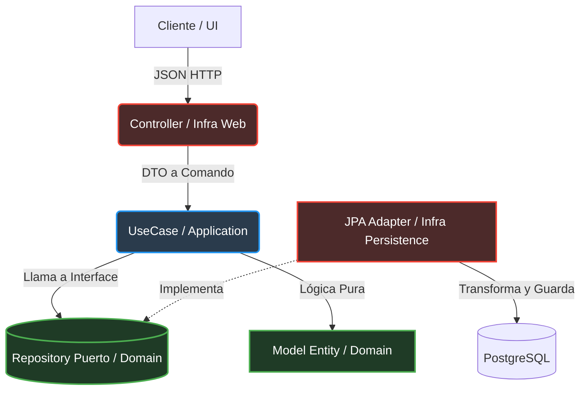
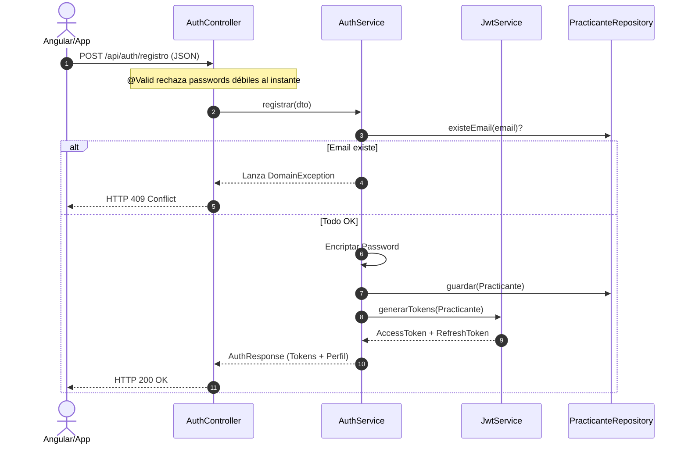
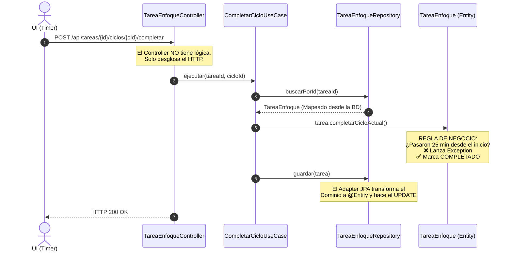

# 📜 Agenda Hunter (Zen Edition) - Documentación Maestra de Arquitectura

Este documento es la Biblia técnica de **Agenda Hunter**. Unifica la visión del producto, la filosofía de ingeniería, el modelado del dominio, la arquitectura hexagonal y los flujos de seguridad. Es tu hoja de ruta de estudio para construir software a nivel *Enterprise*.

---

## 1. Visión de Producto y Filosofía

Agenda Hunter es un sistema backend SaaS diseñado para combatir la procrastinación y la ansiedad tecnológica. Es una fusión perfecta entre la **Filosofía Zen** (calma y enfoque), metodologías de productividad profunda (Deep Work) y la disciplina innegociable de la **Gamificación Silenciosa** (inspirado en las "Daily Quests" de Solo Leveling).

### El Tridente Filosófico
1. **Ritual de Planificación:** El usuario arma su agenda la noche anterior. Al día siguiente, ejecuta sin pensar. El Dominio protege al usuario limitando la carga cognitiva diaria.
2. **El Tridente de Acción:** Separación estricta entre recados rápidos, trabajo profundo y entrenamiento innegociable.
3. **El Jardín (Task Garden):** Completar compromisos genera "Armonía". Fallar en lo innegociable genera "Maleza" y rompe las rachas de disciplina.

---

## 2. El Mapa de la Arquitectura (Estructura del Proyecto)

Seguimos una **Arquitectura Hexagonal (Puertos y Adaptadores)** estricta. El objetivo es aislar la lógica de negocio de las herramientas externas (BD, Web, Frameworks).

```text
com.emersondev.agendahunter
 │
 ├── 🎯 domain              <-- (100% puro Java, EL REY. Cero frameworks)
 │    ├── exception         (Reglas de negocio rotas: MalezaActivaException)
 │    ├── model             (Practicante, TareaEnfoque, RutinaDiaria)
 │    └── repository        (Interfaces/Contratos: PracticanteRepository)
 │
 ├── ⚙️ application         <-- (El Director de Orquesta)
 │    └── usecase           (Flujos: IniciarPomodoro, RegistrarPracticante)
 │
 └── 🔌 infrastructure      <-- (El Mundo Real: Spring Boot, Postgres)
      ├── config            (Configuraciones globales, Beans)
      ├── persistence       (JPA Entities, Adapters, Repositories de Spring)
      └── web               (REST Controllers, DTOs, Security, ExceptionHandlers)
```

### Regla Inquebrantable de Dependencias
**El Dominio NO sabe nada del exterior. El exterior lo sabe TODO sobre el Dominio.**
`Infraestructura` 👉 depende de 👉 `Aplicación` 👉 depende de 👉 `Dominio`.

---

## 3. Flujo de Datos General (Arquitectura Hexagonal)

Para entender cómo se mueve la información, memorizá este flujo. Nunca se salta un paso.



---

## 4. El Dominio (El Lenguaje Ubicuo)

El corazón del sistema. Aquí viven las reglas que hacen que Agenda Hunter sea único.

### A. El Practicante (`Practicante.java`)
Es el usuario del sistema. Su responsabilidad es mantener el estado de disciplina. Estados clave: **Armonía Acumulada** y **Racha de Disciplina**.

### B. El Calendario de Siembra (`CalendarioSiembra.java`)
Es la agenda del día. Impide que el practicante se sobrecargue validando el "Tridente".

### C. El Tridente de la Productividad (Tipos de Tareas)
1. **Recordatorio (`Recordatorio.java`):** Tareas fugaces ("Comprar café"). *One-click*.
2. **Tarea de Enfoque (`TareaEnfoque.java`):** Deep Work. Fraccionada en `CicloEnfoque` (Pomodoros). El backend es el árbitro del tiempo. El usuario inicia el ciclo y el servidor valida que transcurran los 25 min reales antes de permitir completarlo.
3. **Rutina Diaria (`RutinaDiaria.java`):** "Daily Quest" innegociable. Se divide en "Series". Si termina el día y no se completan, se rompe la racha y se genera **Maleza**.

---

## 5. El Ecosistema de Disciplina: Armonía y Maleza (Reglas de Negocio)

Este es el núcleo de la gamificación para mantener el enfoque y combatir el TDAH. Es un sistema de "Deuda y Redención".

### A. ¿Cómo crece la Maleza? (Factores de Penalización)
La maleza representa la procrastinación, las promesas rotas a uno mismo y la falta de disciplina.
1. **El Cambio de Día (Cronjob Nocturno):** A la medianoche (calculado con la `zona_horaria` del practicante), el sistema revisa sus **Rutinas Diarias Innegociables**. Por cada rutina que quedó sin completar, el sistema genera **+1 de Maleza**.
2. **Pomodoros Abandonados:** Si el practicante inicia un ciclo de enfoque de 25 min, pero presiona "Rendirse" o "Cancelar" porque se distrajo, se genera **+1 de Maleza**.
3. *Escalado:* La maleza se acumula (Nivel 1, 2, 3... hasta infinito).

### B. ¿Cómo afecta la Maleza al usuario? (El Castigo Silencioso)
El sistema no te grita ni te manda notificaciones molestas. Simplemente te frena y te bloquea el progreso.
1. **Nivel 1+ (Penalización de XP):** Mientras tengas Maleza mayor a 0, **no generás Armonía (XP)** por completar tareas. Tu jardín está enfermo, el crecimiento se detiene.
2. **Nivel 3+ (Bloqueo de Deep Work):** Si la Maleza llega a 3 o más, el sistema te **prohíbe crear nuevas Tareas de Enfoque**. El dominio no te deja avanzar con proyectos grandes hasta que ordenes el desastre de tus rutinas básicas.
3. **Visualmente:** En la interfaz (PWA/Angular), el jardín virtual se oscurece y se llena de maleza tapando la vista limpia.

### C. ¿Cómo llegar a 0? (Redención y Poda)
Para limpiar la maleza, el practicante tiene que pagar el precio de su indisciplina.
1. **Quemar Armonía:** El practicante puede "comprar" la limpieza. Ejemplo: Gastar 100 puntos de Armonía acumulada para eliminar 1 punto de Maleza (`POST /api/practicantes/me/limpiar-maleza`). Pagás tu deuda con tus ahorros de disciplina pasada.
2. **Tareas de Penitencia (Fricción):** Si el usuario se queda sin Armonía para gastar, el sistema lo obliga a realizar una "Penitencia". Un Pomodoro forzado de 25 minutos (solo para limpiar), donde no se gana XP, solo se elimina 1 de Maleza.

---

## 5. Módulo de Autenticación y Seguridad (Auth)

Sistema de grado comercial construido con Spring Security y JWT. Fricción cero para el usuario con máxima seguridad.

### Mecánica de Tokens
*   **Access Token:** Viaja en la cabecera HTTP (`Bearer <token>`). Vida útil ultra-corta (15 min).
*   **Refresh Token:** Vida larga (7 días). Se usa solo en `/api/auth/refresh` para obtener un nuevo Access Token sin que el usuario vuelva a loguearse.
*   **Fat Payload:** Al hacer login, se devuelve el Token + un `PracticanteDTO` (con ID, nivel, exp) para que el Frontend no tenga que hacer una segunda petición.

### Prevención de Vulnerabilidades (IDOR)
*   Nunca usamos URLs como `GET /api/practicantes/1`.
*   Usamos `GET /api/practicantes/me`. El servidor extrae el ID directamente del JWT (validado por el `JwtAuthenticationFilter` e inyectado en el `SecurityContext`).

### Flujo de Registro y Autenticación



---

## 6. El Flujo de Ejecución (Ej: Completar un Pomodoro)

Veamos cómo interactúan las capas en el código real cuando el usuario aprieta el botón "Completar Pomodoro".



### El Concepto de Mappers
La capa de Infraestructura transforma (mapea) los datos:
1. `DTO` (Web) ➡️ `Parametros/Comandos`
2. `Entidad JPA` (BD) ➡️ `Modelo de Dominio Puro`
3. `Modelo de Dominio Puro` ➡️ `Entidad JPA` (BD)

Esto otorga **Inmunidad**. Si mañana cambiamos PostgreSQL por MongoDB, el Dominio (la carpeta `domain`) **NO SE TOCA**.

---

## 7. El Framework Mental (Cómo Programar en este Proyecto)

Para escalar este sistema sin convertirlo en código espagueti, tatuáte estas reglas (especialmente útiles si usás IA para programar):

1. **Vos sos el Director, la IA ejecuta:** Definí la arquitectura. Pedí a la IA: *"Bajo arquitectura hexagonal, implementame este UseCase"*. No le pidas *"Haceme todo el login"*.
2. **Divide y Vencerás:** Primero modelá el Dominio puro. Luego el Caso de Uso. Por último el Controller y el Repository JPA. Capa por capa.
3. **Conceptos > Código:** Si no entendés un patrón de diseño que sugiere la IA o un compañero, frena. No integres código que no sabés arreglar a las 3 AM con el servidor caído.
4. **Validaciones en los Bordes:** Validá el formato de correos y contraseñas (regex, longitudes) en el `Controller` (usando DTOs y `@Valid`). El Dominio asume que la data está limpia sintácticamente y se enfoca en validaciones **de negocio** (Ej: "No podés tener maleza").
5. **Manejo Centralizado de Errores:** Nunca devuelvas un 500 feo de Java. Usá el `GlobalExceptionHandler` (`@RestControllerAdvice`) para atrapar las `DomainException` y traducirlas a HTTP 400/409 limpios que el Frontend pueda pintar de rojo en pantalla.

---
*Fin del Manual Maestro. Mantener este documento actualizado es clave para la salud del proyecto.*
